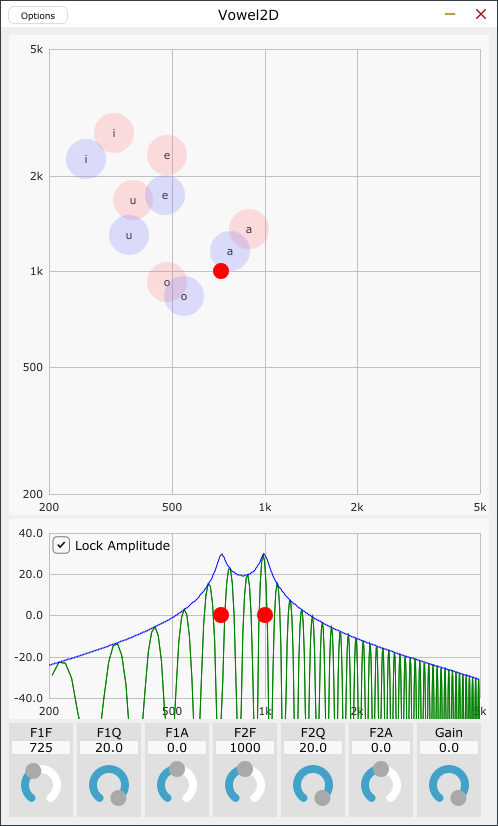

# Vowel2D
 
 

## これ何ですか

2つのバンドパスフィルタを声のフォルマント共鳴器に見立てて母音の再現を試みるツールです。オーディオプラグインまたはスタンドアロンの形式で動作します。  
JUCE frameworkを利用しています。

## ビルドの道具立て

* JUCE framework: [ダウンロードページ](https://juce.com/get-juce/download)または[githubリポジトリ](https://github.com/juce-framework/JUCE)からダウンロードできます。
* Projucer: JUCE frameworkを使ったC++プロジェクトを生成するツールです。[Projucerページ](https://juce.com/discover/projucer)から実行可能なバイナリをダウンロードできますが、JUCE frameworkに同梱のソースを自分でビルドしても良いです。
* ASIO SDK (optional): Windows版のスタンドアロン形式でASIOを有効化できます。[デベロッパページ](https://www.steinberg.net/developers/)からダウンロードできます。
* C++ビルドツール: Visual Studio 2017～2022、Xcodeなど、目的のターゲットプラットフォームに合わせたもの。

JUCEが対応するプラットフォーム、バイナリ形式、ライセンスについては[JUCE](https://juce.com/)で確認してください。

## ビルドの道のり

1. Projucerで.jucerファイルを開く。
2. Modulesセクションにおいて、ビルド環境に合わせてmoduleパスを修正する。
3. Exporterセクションにおいて、目的のターゲットプラットフォームを追加する。
4. File|Save ProjectメニューでC++プロジェクトを書き出す。
5. Buildsフォルダ下に書き出されたC++プロジェクトをビルドする。

以下の環境で動作を確認していますが、MacやLinux、AUやLV2でもビルドできると思います。(要確認)
* Windows 11 Pro
* Visual Studio 2022
* JUCE framework 7.0.1
* プラグインホスト: JUCE frameworkに同梱のAudioPluginHostアプリケーション
* VST3、スタンドアロン形式のビルド

## 動作

  
**fig.1 ブロックダイアグラム**

1次対バンドパスフィルタをカスケードして、フォルマント共鳴器としています。(fig.1)

入出力バスのチャネル数について、2通りの動作様式があります。
* 0対nまたは1対n動作: 入力チャネル数が0または1の場合、1チャネル分のプロセッサ出力を全ての出力チャネルにコピーします。
* n対n動作: 入力チャネル数が2以上かつ入出力チャネル数が同数の場合、チャネルごと独立したプロセッサが動作します。

## 使い方

プラグインやプラグインホストの基本的な知識については、ここでは省きます。  

* 入力信号にフォルマントフィルタを掛けます。外部入力のほか、内蔵のパルス音源をMIDIで演奏することが出来ます。
* 上段の母音ペインをクリックまたはドラッグすることでバンドパスフィルタの中心周波数を移動します。横軸と縦軸がそれぞれ第一・第二フォルマントです。
* 中段の周波数特性ペインで個々のバンドパスフィルタの中心周波数とゲインを操作します。出力のスペクトルもここに表示されます。
* 下段のツマミで個々のパラメータをチューニングします。数値入力も出来ます。出力ゲインもここで設定します。

## 作者

[yu2924](https://twitter.com/yu2924)

## ライセンス

MIT License
